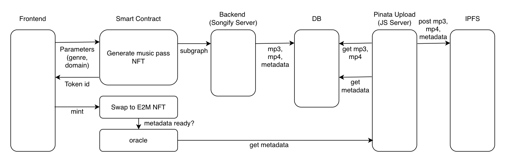

# KOLA Audio Identity Smart Contract

This repo contains Kola audio identity smart contract. The overall tech architecture is designed as follows.

The frontend parses user input parameters such as genre and domain, and user submits a transaction to purchase the music pass according to the music properties and domain name. The backend will read the domain name and music properties constantly from the smart contract and generate the music accordingly. Audio file, video file and metadata will be uploaded to IPFS after generating the music. User then can submit another transaction to swap their music pass to music NFT. When user submits the second transaction, the smart contract will invoke an oracle function to get the metadata of a corresponding domain and record on chain.  

The smart contract depends on a development environment using Truffle and the Ethereum-Bridge. Head on over to the `./contracts` folder to find all the smart contracts and the `./test` folder examines the javascript files that thoroughly test the smart-contract.

## Instructions

**1)** Launch Truffle:

__`❍ npx truffle develop`__

**2)** Open a _new_ console in the same directory & spool up the ethereum-bridge:

__`❍ npx ethereum-bridge -a 9 -H 127.0.0.1 -p 9545 --dev `__

**3)** Once the bridge is ready & listening, go back to the first console with Truffle running & set the tests going!

__`❍ truffle(develop)> test`__

__`❍ truffle(develop)> compile`__

__`❍ truffle(develop)> deploy`__

&nbsp;

__*Happy developing!*__
